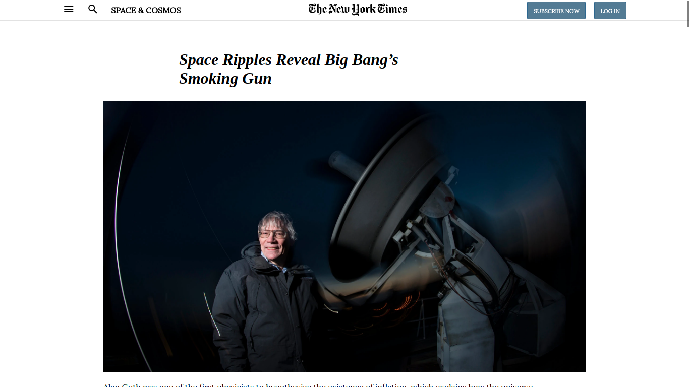

# Clone of The New York Times Article: Space Ripples Reveal Big Bang’s Smoking Gun

> This project was to clone the The New York Times Article account and is part of the Positioning and Floating Elements section in the Microverse Curriculum.

This project contains the following features:

1. Header, Footers and Main body Article
2. Aside for Editors' Picks, Grid Layouts and FlexBox was used 
3. Embedded video, "More in Astronomy" Section, Most Popular Section
4. Final Footer with links to all other parts of The New York Times

## Built With

- HTML5 and CSS
- Font Awesome Icons

## Live Demo

[Live Demo Link](https://rawcdn.githack.com/hillarioh/Mint.com-Signup-Page-Clone/7e6ae5140a69a5ad388f2c79538b72e2db893245/index.html)

## Authors

👤 Azeem Ahmed

- Github: [@Azeem838](https://github.com/Azeem838)

👤 Akash Pathak

- Github: @0prodigy
- Twitter: @pathakprodigy
- Linkedin: Akash Pathak
- Email: (pathakvikash9211@gmail.com)

## 🤝 Contributing

Contributions, issues and feature requests are welcome!

Feel free to check the [issues page](https://github.com/hillarioh/Mint.com-Signup-Page-Clone/issues).

## Show your support

Give a ⭐️ if you like this project!

## 📝 License

This project is [MIT](lic.url) licensed.
